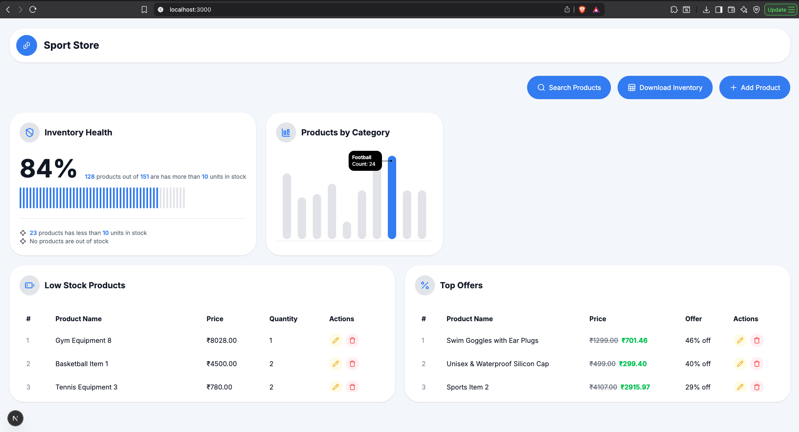
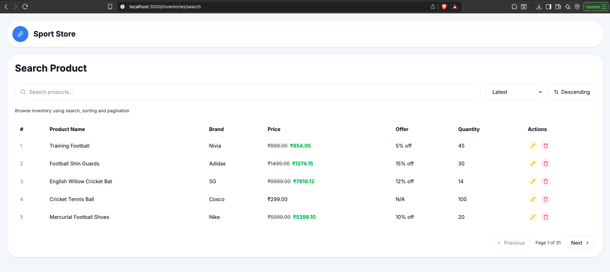

# Sport Store Inventory Management System

A full-stack inventory management application with a Next.js frontend and a Go backend.

This repo contains two independently documented services:

- `frontend/` — Next.js inventory dashboard UI
- `backend/` — Go API and Excel export worker

> See [frontend/README.md](./frontend/README.md) and [backend/README.md](./backend/README.md) for detailed setup and implementation notes.

---

## Screenshots & Visuals




---

## Features Checklist

- ✅ Inventory dashboard with analytics summary cards
- ✅ Inventory list view with category filtering
- ✅ Inventory edit flow (`/inventories/[id]/edit`)
- ✅ Backend REST API for inventories, categories, dashboard, and exports
- ✅ Asynchronous Excel export pipeline
- ✅ PostgreSQL schema and seed data scripts
- ✅ React Query caching and client/server split UI
- ✅ Healthcheck endpoint
- ✅ Responsive UI using Tailwind CSS
- ⚠️ Authentication / authorization
- ⚠️ Persistent export jobs and queue storage
- ⚠️ Database migration tooling
- ⚠️ End-to-end or unit test coverage
- ⚠️ Docker / deployment manifests

---

## Progress Summary

This project is currently in the **80–90% completion range** against the original plan.

### Completed

- ✅ Built a working backend with REST APIs for inventory, category, dashboard, and export
- ✅ Implemented frontend dashboard, inventory listing, and edit page
- ✅ Added analytics endpoints for low stock, offers, and category distribution
- ✅ Integrated Excel export job flow and download support
- ✅ Added database initialization scripts for schema and sample data
- ✅ Documented frontend and backend in separate README files
- ✅ Delivered a stable server/client hybrid frontend architecture

### Remaining / Missed

- ⚠️ gRPC gateway and protobuf service layer were not implemented
- ⚠️ Export job tracking is still in-memory and not durable across restarts
- ⚠️ No authentication or user access control exists
- ⚠️ No migration framework or automated schema migrations
- ⚠️ UI error handling is minimal and lacks production-ready feedback
- ⚠️ No test suite is provided yet
- ⚠️ Dockerization and deployment orchestration are not included

---

## Tech Stack


---

## Architecture

The project is designed as a clean separation between the UI and service layer, with a backend export worker and PostgreSQL persistence.

```text
Browser / End user
      |
      |  HTTP
      v
Next.js Frontend (React, Tailwind, React Query)
      |
      |  REST / API calls
      v
Go Backend (Gin)
      |
      |  GORM
      v
PostgreSQL Database

Backend export worker:
  └─ Generates Excel reports using excelize
  └─ Persists files to backend/exports
  └─ Tracks job state in memory
```

### Detailed flow

```text
[Browser] --> [Next.js UI] --> [Backend API]
                              |---> [Inventory CRUD]
                              |---> [Dashboard metrics]
                              |---> [Export job enqueue]
                                      |--> [Export worker]
                                      |--> [Excel file saved on disk]
                              |---> [Category data]
[Backend API] --> [PostgreSQL]
```

---

## Repository Layout

```text
sport-store-inventory/
├── backend/
│   ├── cmd/server/main.go
│   ├── internals/
│   ├── scripts/
│   │   ├── schema.sql
│   │   └── seed.sql
│   └── README.md
├── frontend/
│   ├── app/
│   ├── components/
│   ├── lib/
│   ├── providers/
│   ├── services/
│   ├── types/
│   └── README.md
├── LICENSE
└── README.md
```

---

## Getting Started

### Frontend

```bash
cd frontend
npm install
npm run dev
```

Open [http://localhost:3000](http://localhost:3000).

### Backend

```bash
cd backend
go run ./cmd/server
```

Open [http://localhost:8080](http://localhost:8080) and ensure `.env` is configured.

> For full installation, API routes, and environment details, see [frontend/README.md](./frontend/README.md) and [backend/README.md](./backend/README.md).

---

## What This Helps You Show

This README is designed to help you show what you built, what is complete, and what remains to be polished for a production-grade delivery.

---

## Future Improvements

- Add authentication and authorization
- Persist export jobs and results in a database or queue
- Add database migrations with `golang-migrate`
- Add frontend and backend test coverage
- Add Docker / deployment manifests
- Improve UI error handling and feedback
- Add monitoring and logging for production readiness

---

## License

This project is licensed under the [MIT License](./LICENSE).

---

## Author

**Pritam Kininge** — Senior Software Developer  
📍 Pune, India (UTC+5:30)  
🗓️ Submitted: May 31, 2026  
[LinkedIn](https://linkedin.com/in/pritam-kininge) | [GitHub](https://github.com/kininge) | [Leetcode](https://leetcode.com/u/kininge007/)
